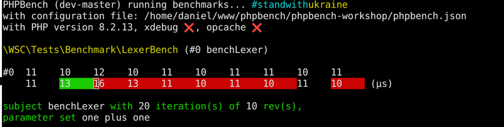

# PHPBench Workshop WSC 2024
## Locking down performance with PHPBench


---
<!--- theme: default -->
# About Me
* **Name**: Daniel Leech
* **Profession**: Software Contracting Development Developer
* **PHP Projects**: PHPBench, Phpactor, PHP-TUI

---
# About this workshop
* **Part 0**: Introduction
* **Part 1**: Writing Benchmarks
* **Part 2**: Customising PHPBench
---
<!-- header: git clone git@github.com:dantleech/wsc-2024-phpbench -->
# Prerequsities

- Git
- Composer (getcomposer.org)
- PHP 8.1

---
<!-- header: git clone git@github.com:dantleech/wsc-2024-phpbench -->

# What is PHPBench?
* It's **like** PHPUnit but for performance.

---
<!-- header: git clone git@github.com:dantleech/wsc-2024-phpbench -->
# What does it do exactly?
* Samples the execution time of your code
* Provides statistics
* Generates reports
* Integrates with XDebug
* Makes you coffee
---
<!-- header: git clone git@github.com:dantleech/wsc-2024-phpbench -->


---


---
# The Example Application


We'll be working with a simple Symfony Console application.

The application is a **Polish Calculator**:

```shell
$ bin/calculate "+ 1 1" 
The answer is 2
```

In Polish notation the operator comes _before_ the operands:

`<operator> <operand1> <operand2>`

- `+ 1 1` = 2
- `+ + 2 2 2` = 6
- `+ + 2 2 * 2 4` = 12

Polish notation is unambiguous and requires no parenthesis!


---
<!-- header: Creating a benchmark: `part1` -->
# Install the Example Project
```shell
git clone git@github.com:dantleech/wsc-2024-phpbench
cd wsc-2024-phpbench
composer install
```

Run the application:

```
$ bin/console "* 2 + 4 * 8 8"
The answer is 136
```

_the above would be written as `2 x (4 + 8 * 8)` with standard precedence_.

---
# Setup PHPBench

Create the PHPBench config file:

```
$ vendor/bin/phpbench config:init
```

Add the path to where our benchmarks will live:

```json
// phpbench.json
{
    "$schema": "vendor/phpbench/phpbench/phpbench.schema.json",
    "runner.path": "tests/Benchmark"
}
```

---
# Create a Benchmark

Create the file `LexerBench.php` in `tests/Benchmark` then run PHPBench:

```php
<?php

namespace WSC\Tests\Benchmark;

use WSC\Parser\Lexer;

class LexerBench {
    public function benchLexer(): void  {
        $lexer = new Lexer();
        $lexer->lex('+ 1 2');
    }
}
```

```shell
$ vendor/bin/phpbench run
```

---
# Include the autoloader


**It's a trap**. The autoloader must be specified in the `phpbench.json` configuration file:
```json
// phpbench.json
{
    // ...
    "runner.bootstrap": "vendor/autoload.php"
}
```

```shell
$ vendor/bin/phpbench run
PHPBench (dev-master) running benchmarks... #standwithukraine
with configuration file: /home/daniel/www/phpbench/phpbench-workshop/phpbench.json
with PHP version 8.2.13, xdebug ❌, opcache ❌

\WSC\Tests\Benchmark\LexerBench

    benchLexer..............................I0 - Mo93.000μs (±0.00%)

Subjects: 1, Assertions: 0, Failures: 0, Errors: 0
```

---
<!-- header: Refining the Benchmark: `part2` -->
# Part 2

---

<!-- header: Refining the Benchmark: `part2` -->
# Iterations and Revs

Change the number of samples by specifying `--iterations`:
```
vendor/bin/phpbench run --iterations=10
```

Change the of repetitions **in** a sample by specifying `--revs`:

```
vendor/bin/phpbench run --revs=10
```

---
# Iterations and Revs

We can also specify them on the benchmark level with attributes:

```php
<?php

// ...
use PhpBench\Attributes as Bench;

#[Bench\Iterations(10)]
#[Bench\Revs(10)]
class LexerBench
{
    // ...
}
```

```
vendor/bin/phpbench run
```

---
# Retry Threshold

Keep going until we get a good answer!

```
vendor/bin/phpbench run --retry-threshold=2 --progress=blinken
```



---
# Param Providers

Parameterise your benchmark with `#[ParamProviders]`

```php
<?php

// ...
use Generator;
use PhpBench\Attributes as Bench;

class LexerBench {
    #[Bench\ParamProviders('provideLexer')]
    public function benchLexer(array $params): void {
        // ...
    }

    public function provideLexer(): Generator {
    }
}
```

---
# Param Providers

```php
<?php

// ...
use Generator;
use PhpBench\Attributes as Bench;

class LexerBench {
    #[Bench\ParamProviders('provideLexer')]
    public function benchLexer(array $params): void {
        // ...
        $lexer->lex($params['expr']);
    }

    public function provideLexer(): Generator {
        yield 'one plus one' => [
            'expr' => '+ 1 1',
        ];
        yield 'longer expression' => [
            'expr' => '+ 2 2 * 2 4 / 1 + 5 * 10 10',
        ];
    }
}
```

---
# Comparing Benchmarks

Store and tag a benchmark run for future reference with `--tag`:

```
./vendor/bin/phpbench run --tag=master
```

Compare the performance with the previous version:

```
./vendor/bin/phpbench run --ref=master
```

Try and optimise the code!
