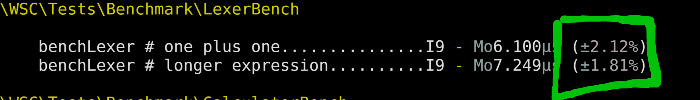

# PHPBench Workshop WSC 2024
## Locking down performance with PHPBench


---
<!--- theme: default -->
# About Me
* **Name**: Daniel Leech
* **Profession**: Software Contracting Development Developer
* **PHP Projects**: PHPBench, Phpactor, PHP-TUI

---
# About this workshop
- Introduction
- Creating benchmarks
- Refininement
- Excercise
- Reports
---
<!-- header: git clone git@github.com:dantleech/wsc-2024-phpbench -->
# Prerequsities

- Git
- Composer (getcomposer.org)
- PHP 8.1
- Optionally xdebug and Kcachegrind!

---
<!-- header: git clone git@github.com:dantleech/wsc-2024-phpbench -->

# What is PHPBench?
* It's **like** PHPUnit but for performance.

---
<!-- header: git clone git@github.com:dantleech/wsc-2024-phpbench -->
# What does it do exactly?
* Samples the execution time of your code
* Provides statistics
* Generates reports
* Integrates with XDebug
* Makes you coffee
---
<!-- header: git clone git@github.com:dantleech/wsc-2024-phpbench -->


---


---
# The Example Application


We'll be working with a simple Symfony Console application.

The application is a **Polish Calculator**:

```shell
$ bin/calculate "+ 1 1" 
The answer is 2
```

In Polish notation the operator comes _before_ the operands:

`<operator> <operand1> <operand2>`

- `+ 1 1` = 2
- `+ + 2 2 2` = 6
- `+ + 2 2 * 2 4` = 12

Polish notation is unambiguous and requires no parenthesis!


---
<!-- header: Creating a benchmark: `part1` -->
# Install the Example Project
```shell
git clone git@github.com:dantleech/wsc-2024-phpbench
cd wsc-2024-phpbench
composer install
```

Run the application:

```
$ bin/calculate "* 2 + 4 * 8 8"
The answer is 136
```

_the above would be written as `2 x (4 + 8 * 8)` with standard precedence_.

---
# Setup PHPBench

Create the PHPBench config file:

```
$ vendor/bin/phpbench config:init
```

Add the path to where our benchmarks will live:

```json
// phpbench.json
{
    "$schema": "vendor/phpbench/phpbench/phpbench.schema.json",
    "runner.path": "tests/Benchmark"
}
```

---
# Create a Benchmark

Create the file `LexerBench.php` in `tests/Benchmark` then run PHPBench:

```php
<?php

namespace WSC\Tests\Benchmark;

use WSC\Parser\Lexer;

class LexerBench {
    public function benchLexer(): void  {
        $lexer = new Lexer();
        $lexer->lex('+ 1 2');
    }
}
```

```shell
$ vendor/bin/phpbench run
```

---
# Include the autoloader


**It's a trap**. The autoloader must be specified in the `phpbench.json` configuration file:
```json
// phpbench.json
{
    // ...
    "runner.bootstrap": "vendor/autoload.php"
}
```

```shell
$ vendor/bin/phpbench run
PHPBench (dev-master) running benchmarks... #standwithukraine
with configuration file: /home/daniel/www/phpbench/phpbench-workshop/phpbench.json
with PHP version 8.2.13, xdebug ❌, opcache ❌

\WSC\Tests\Benchmark\LexerBench

    benchLexer..............................I0 - Mo93.000μs (±0.00%)

Subjects: 1, Assertions: 0, Failures: 0, Errors: 0
```

---
<!-- header: Refining the Benchmark: `part2` -->
# Part 2

---

<!-- header: Refining the Benchmark: `part2` -->
# Iterations and Revs

Change the number of samples by specifying `--iterations`:
```
vendor/bin/phpbench run --iterations=10
```

Change the of repetitions **in** a sample by specifying `--revs`:

```
vendor/bin/phpbench run --revs=10
```

---
# Iterations and Revs

We can also specify them on the benchmark level with attributes:

```php
<?php

// ...
use PhpBench\Attributes as Bench;

#[Bench\Iterations(10)]
#[Bench\Revs(10)]
class LexerBench
{
    // ...
}
```

```
vendor/bin/phpbench run
```

---
# Param Providers

Parameterise your benchmark with `#[ParamProviders]`

```php
<?php

// ...
use Generator;
use PhpBench\Attributes as Bench;

class LexerBench {
    #[Bench\ParamProviders('provideLexer')]
    public function benchLexer(array $params): void {
        // ...
    }

    public function provideLexer(): Generator {
    }
}
```

---
# Param Providers

```php
<?php

// ...
use Generator;
use PhpBench\Attributes as Bench;

class LexerBench {
    #[Bench\ParamProviders('provideLexer')]
    public function benchLexer(array $params): void {
        // ...
        $lexer->lex($params['expr']);
    }

    public function provideLexer(): Generator {
        yield 'one plus one' => [
            'expr' => '+ 1 1',
        ];
        yield 'longer expression' => [
            'expr' => '+ 2 2 * 2 4 / 1 + 5 * 10 10',
        ];
    }
}
```

---
# Relative Standard Deviation

How stable were the results?


Red is bad! It indicates lots of variation in the results.

---
# Retry Threshold

Keep going until we get a good answer!

```
vendor/bin/phpbench run --retry-threshold=5
```




Also try:

```
vendor/bin/phpbench run --retry-threshold=2 --progress=blinken
```

---
# Setup

Move the instantiation of the Lexer to a `setUp` method:

```php
// ...
#[Bench\BeforeMethods("setUp")]
class LexerBench
{
    private Lexer $lexer;

    public function setUp(): void
    {
        $this->lexer = new Lexer();
    }

    public function benchLexer(array $params): void
    {
        // ...
        $this->lexer->lex($params['expr']);
    }
}
```
---
# Setup

You can also use `__construct`:

```php
// ...
class LexerBench
{
    private Lexer $lexer;

    public function __construct()
    {
        $this->lexer = new Lexer();
    }

    public function benchLexer(array $params): void
    {
        // ...
        $this->lexer->lex($params['expr']);
    }
}
```

---
# Comparing Benchmarks

Store and tag a benchmark run for future reference with `--tag`:

```
$ vendor/bin/phpbench run --tag=master
```

Compare the performance with the previous version:

```
$ vendor/bin/phpbench run --ref=master
```


Try and optimise the code!


---
# Assertions

You can use assertions to cause PHPBench to fail if a benchmark takes too
long:

```php
class LexerBench
{
    #[Bench\Assert('mode(variant.time.avg) < 1 microseconds +/- 10%')]
    public function benchLexer(array $params): void
    {
        // ...
    }
}
```

```shell
$ vendor/bin/phpbench run
```

---


---
<!-- header: Calculator Bench: `part3` -->
# Part 3

---
# Create a Calcuator Benchmark

Using your new knowledge create a benchmark for the Calculator class:

```php
$calculator = Calculator::create();
$calculator->calculate('+ 1 1');
```

- Use a `BeforeMethods` attribute.
- Add `Iterations` and `Revs` attributes.
- Introduce a `ParamProvider`
- Run it with `--retry-threshold`
- `--tag` and `--ref`
- Use the `Assert` attribute attribute

---
<!-- header: Custom Reports: `part4` -->
# Part 4

---
# Rendering reports

Render reports to the terminal:

```
$ vendor/bin/phpbench run --report=benchmark
```

Render reports to HTML:

```
$ vendor/bin/phpbench run --report=bar_chart_time --output=html
Written report to: /home/daniel/www/phpbench/phpbench-workshop/.phpbench/html/index.html
```

Open the page in your browser.

---
# Report on previous runs

You can generate reports on any tagged benchmark. First create a tagged run:

``` shell
$ vendor/bin/phpbench run --tag=tag1
```

Then you can report on it independently with the `report` command:

```shell
$ vendor/bin/phpbench report --report=aggregate --ref=tag1
```

---


---
# Customise a Report

You can easily customise an existing report `generator`. Run the following command to
generate the config for a new report *based* on the `bar_chart_time` generator:

```
vendor/bin/phpbench config:extend generator bar_chart_time wsc
```

Now open `phpbench.json`

---

```shell
$ vendor/bin/phpbench config:extend generator bar_chart_time wsc
```
```
{ // phpbench.json
    // ...
    "report.generators": {
        "wsc": {
            "title": null,
            "components": [
                {
                    "extends": "bar_chart_time"
                }
            ],
            // ...
        }
    }
}
```
```shell
$ vendor/bin/phpbench run --report=wsc
```

---
# Edit a component

The report rendered a bar chart "component" which can also be customized:

```
vendor/bin/phpbench config:extend component bar_chart_time wsc_component
```

---
```
vendor/bin/phpbench config:extend component bar_chart_time wsc_component
```

# Update the component

Open `phpbench.json`. The new `report.components` section has been added. Change your generator to use it:

```diff
             "filter": null,
             "components": [
                 {
-                    "extends": "bar_chart_time"
+                    "extends": "wsc_component"
                 }
             ],
             "tabbed": false,
             "tab_labels": [],
             "generator": "component"
         }
```

---
# Customise the component


Let's create a new bar:

```diff
             "bar_partition": [
-                "suite_tag"
+                "benchmark_name"
             ],
             "y_axes_label": "yValue as time precision 1",
             "x_axes_label": null,
```

```
vendor/bin/phpbench run --report=wsc
```

---
# Add a new component

Let's add a paragraph of text to the `wsc` generator:

```json
{
    // ...
    "report.generators": {
        "wsc": {
            // ...
            "components": [
                {
                    "component": "text",
                    "text": "Hello world! This is my paragraph of text. There are many like it but this one is mine."
                },
                // ...
            ]
        }
    }
}
```

---
# Add a table

```json
{
    "report.generators": {
        "wsc": {
            "components": [
                // ...
                {
                    "component": "table_aggregate",
                    "partition": "benchmark_name",
                    "row": {
                        "net_time": "sum(partition['result_time_net']) as time"
                    }
                },
            ]
        }
    }
}
```

---
# Inspecting available columns


The `partition` is a data frame. You can check which columns are available with
the `bare` report:

```
vendor/bin/phpbench report --ref=latest --report=bare-vertical
```

---
# Add a table

```json
{
    "report.generators": {
        "wsc": {
            "components": [
                // ...
                {
                    "component": "table_aggregate",
                    "partition": "benchmark_name",
                    "row": {
                        "name": "first(partition['benchmark_name'])",
                        "iterations": "count(partition['variant_iterations'])",
                        "revs": "sum(partition['result_time_revs'])",
                        "mode": "mode(partition['result_time_avg']) as time",
                        "net_time": "sum(partition['result_time_net']) as time"
                    }
                },
            ]
        }
    }
}
```

---
# Expression Functions

- `first` return the first entry in the column.
- `count` return the number of values in the column
- `sum` return the sum of the values
- `mean` return the _average_.
- `mode` return the KDE mode (better than the average!)
- `stdev` return standard deviation
- `max` and `min` min and max values

https://phpbench.readthedocs.io/en/latest/expression.html#functions

```
vendor/bin/phpbench eval "first([1,2,3])"
vendor/bin/phpbench eval "mode([1,2,3])"
```

---
# Time and Memory Units

You can coerce any number in a time unit:

```
vendor/bin/phpbench eval "10 as microseconds"
vendor/bin/phpbench eval "1000 as milliseconds"
vendor/bin/phpbench eval "2000000 as seconds"
vendor/bin/phpbench eval "2301020 as time"
```

And the number will be formatted:

```
vendor/bin/phpbench eval "1000000 as seconds"                                                                                      part2 ✱
1.000s
= 1.000s
```

---
# Challenge

Update your report to:

- Show the PHP version
- Add the average sys load
- Show the average memory usage in kilobytes
